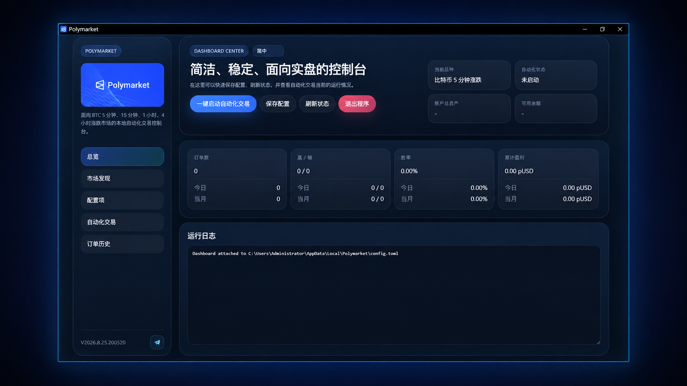
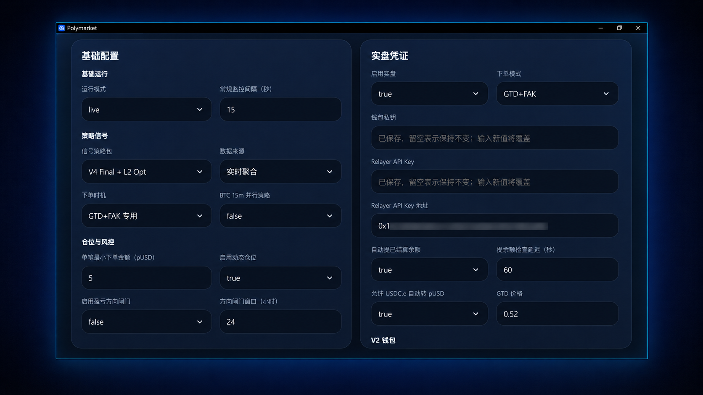

# Polymarket BTC 5m 自动化交易机器人

**简体中文** | [English](./README_EN.md)

[下载最新版本](../../releases/latest) · [查看公开回放报告](./REPORTS.md) · [申请试用](https://t.me/polymarket_b)

**这是一套专为 Polymarket BTC 5 分钟 Up or Down 市场设计的自动化量化交易系统：通过自主研发的信号策略判断方向，并自动完成仓位调整、风险控制、下单和订单跟踪，可在 Windows 本地或 Linux 服务器运行。**

> **使用前请注意**
>
> 这是第三方独立开发的工具，与 Polymarket 官方无隶属、授权或背书关系。自动交易不等于稳定盈利；请确认所在地区的适用规则，并只投入能够承受损失的资金。



## 目录

1. [策略核心与历史表现](#1-策略核心与历史表现)
2. [信号策略、风控与动态仓位架构](#2-信号策略风控与动态仓位架构)
3. [自动化如何把策略跑成闭环](#3-自动化如何把策略跑成闭环)
4. [第一次使用](#4-第一次使用)
5. [安装与部署](#5-安装与部署)
6. [运行中你要看什么](#6-运行中你要看什么)
7. [账户凭证、安全与隐私](#7-账户凭证安全与隐私)
8. [常见问题与支持](#8-常见问题与支持)
9. [风险声明与 License](#9-风险声明与-license)

## 1. 策略核心与历史表现

这套策略由我们历时半年自主研发，并通过持续的历史回放和最新市场数据不断验证、完善。策略由多类信号共同组成：先识别趋势延续、动能衰竭、结构反转等市场状态，再结合各信号独立维护的影子状态、当前行情环境和后置规则进行复核，最终决定保持方向、调整方向或不参与。方向确定后，动态仓位和风控系统再根据资金规模、近期表现和账户条件，确定订单金额与是否执行。

### 可公开的历史证据

我们保留旧版本和最新版本的独立报告，而不用新数据覆盖历史结果。三份报告回答的问题不同：

| 报告 | 用途 | 关键摘要 |
| --- | --- | --- |
| [最新 Stability Expansion 策略标准回放](./BACKTEST.md) | 只比较信号方向质量和风险路径 | 146,846 笔，63.87%，标准 Score +109,880 |
| [Stability Expansion 策略动态仓位与风控回放](./BACKTEST_CAPITAL.md) | 在同一批最新信号上观察理想化资金路径 | 400 pUSD 初始资金，期末 21,273,734.6 pUSD；见报告口径和限制 |
| [V4 Final + L2 Opt V16 策略包标准回放](./BACKTEST_V16.md) | 保留旧策略版本的可追溯结果 | 18,285 笔，63.75%，标准 Score +13,479 |

标准回放使用固定 `+4/-5` 计分，用于比较信号质量；资金回放则额外纳入动态仓位和公共风控。两者不能直接混算，也都不等于实盘账户收益。完整版本、方法、年度与近期结果见[公开回放报告中心](./REPORTS.md)。

最新 Stability Expansion 策略包暂未经过长时间验证，建议优先在模拟模式下运行一段时间，确认策略状态、信号表现及稳定性符合预期后，再根据自身风险承受能力考虑用于实盘交易。实盘建议以V4 Final + L2 Opt V16 策略包及推荐配置运行，不构成任何未来收益承诺。

## 2. 信号策略、风控与动态仓位架构

整套逻辑的关系可以概括为：

```text
已收盘行情与当前可用状态
                ↓
      数据连续性与新鲜度检查
                ↓
  趋势/延续   衰竭/反转   结构/行情环境
        └───多类原生信号并行生成候选───┘
                ↓
        各自依赖的独立影子状态
                ↓
     波动环境、局部结构与重复触发复核
                ↓
      冲突合并：唯一方向或不参与
                ↓
        固定仓位 / 动态仓位
                ↓
   账户、余额、额度、重复与执行风控
                ↓
          允许下单或最终阻止
```

这个顺序很重要：信号层先回答“方向是什么”，状态和行情层再回答“这次是否仍然值得相信”，仓位层决定“最多下多少”，最后的执行风控决定“现在能不能安全下单”。

### 信号如何形成

每个目标市场只会得到一个最终结果：保持候选方向、调整方向，或不参与。整个判断只使用当时已经可用的行情和状态。

原生信号的任务是先回答“当前行情出现了哪一类可交易结构”，并给出一个基础方向。它不直接等于最终订单。

- **趋势与延续候选**会观察价格是否持续向同一方向推进，这种推进是否有效，以及收盘与成交结构是否仍然支持延续；
- **衰竭与反转候选**会观察行情是否已经过度推进，推进效率是否下降，以及收盘、影线或成交表现是否与原方向开始背离；
- **结构与行情候选**会区分真正的方向突破、短暂插针、无效突破、持续低波噪声和波动突然切换。

候选的形成会综合方向持续性、推进效率、波动状态、K 线与收盘结构、动量衰竭、成交结构和近期触发密度，任何单一维度都不会独立决定最终方向。

### 行情环境与候选合并

同样的价格变化，出现在长时间低波动后的突然放大、持续高波动中，或者噪声震荡中，含义并不相同。

行情环境层判断当前更适合延续、反转还是暂时回避，并决定原生候选在当前环境中保持、降级、调整或停止。

同一个市场窗口可能同时出现延续与反转候选。每个候选都保留自己的来源、基础方向、依赖的影子状态和后置规则，再按确定的冲突与优先关系合并。调整只作用于当前候选；无法得到唯一可信结果时，该窗口不下单。

### 影子状态：让不同信号各自记录表现

你可以把影子理解成“每类信号自己的状态记录”。某类信号在当前行情里变弱，只会影响依赖它的部分；其他已就绪的信号仍可以正常判断。

影子不是看实盘账户刚刚赚了还是亏了，就立即把整套策略反向。它使用对应信号已经完成、当时可以确认结果的事件序列，按时间顺序维护该分支的状态。

- 影子按时间顺序推进；
- 只影响依赖它的策略部分，不应无条件阻断无关信号家族；
- 可以保持、调整、暂停或仅允许条件候选；
- 不是额外真实订单，也不会根据账户亏损追损加码；
- 不会在每次下单前重新下载和重算整段历史。

### 后置规则处理“信号成立，但现在不适合直接下单”

原生信号和影子状态通过后，并不代表必然下单。后置规则专门处理局部结构突变、极低或极高波动、波动状态切换、短时间重复触发，以及信号刚出现后已经发生的结构变化。

它只修正命中对应条件的候选，不会无条件改写其他信号。可能的结果是保留原方向、调整当前候选，或者直接 STOP。

### 动态仓位随资金规模调整订单金额

固定仓位为每笔订单使用设定金额，仍受平台最低金额、余额、每日次数和每日总金额限制。

动态仓位在最终方向确定后独立计算。它以最新可用余额和近期策略表现为基础：资金规模持续增长且策略表现稳定时，逐步提高目标订单金额，让盈利阶段更充分地利用已增长的资金。

当行情变化导致策略进入回撤或连续亏损时，动态仓位会主动缩小订单金额，减少弱势阶段对已累积收益的侵蚀；随着策略表现恢复，仓位也会逐步恢复并重新进入放大阶段。

整个调节过程仍受基础目标仓位、单笔上限、安全余额、平台最低金额和账户实际可用资金约束。动态仓位只调整订单金额，不改变信号方向，也不会因亏损而追损加码。

### 多层风险控制

| 风控层 | 主要检查 |
| --- | --- |
| 信号层 | 有效方向、影子状态、行情环境、冲突合并 |
| 仓位层 | 固定/动态仓位、单笔上限、安全余额、滚动表现 |
| 账户层 | 运行模式、实盘开关、凭证、余额、授权、每日额度 |
| 执行层 | 目标市场、交易窗口、重复执行、订单模式和盘口条件 |
| 运行层 | 行情后备、数据补齐、异常重试、日志、supervisor 和 watchdog |

这些机制只能限制风险暴露，不能消除方向错误、连续亏损、滑点、流动性、网络和第三方接口风险。

### 我们怎么核对回放和实际逻辑

策略只能使用决策时点已经存在的信息。历史重放和运行状态按时间顺序推进，当前目标市场尚未产生的结果不能提前进入当前决策，影子也只能由已经完成并可以确认结果的事件更新。

策略升级验收会检查逐笔时间、目标窗口、来源、基础方向、后置动作、最终方向、STOP结果、年度/月度/周度表现、回撤、连续亏损、数据连续性和未改动区间的逐笔一致性。内部验收用于降低未来数据、时序错位、状态污染和研究逻辑与代码实现漂移风险，但不等于第三方审计。

公开文档不会披露指标公式、历史窗口、阈值、权重、方向映射、分支触发条件和内部优先级参数。

## 3. 自动化如何把策略跑成闭环

自动化层按策略规则执行数据时序、信号合并、仓位、风控和订单流程，并负责订单跟踪、异常恢复、结果记录和可选仓位领取。

### 从启动到下一交易窗口

```text
启动程序并恢复已保存状态
          ↓
发现、校验目标市场和交易窗口
          ↓
维护 Binance 与 Polymarket 行情
          ↓
检查 K 线连续性、数据新鲜度和影子就绪状态
          ↓
原生信号 → 对应影子状态 → 行情环境与后置规则
          ↓
合并为唯一最终方向，或跳过当前窗口
          ↓
计算固定/动态仓位并执行多层风控
          ↓
按配置执行 GTD、FAK 或组合下单
          ↓
跟踪提交、挂单、成交、部分成交和异常状态
          ↓
确认交易状态并等待目标市场结果
          ↓
记录胜负、盈亏、触发分支和决策原因
          ↓
按配置领取可领取仓位并维护可用余额
          ↓
保存状态、水位和日志
          ↓
进入下一目标市场
```

没有有效信号、必需状态未就绪、风控或执行条件不满足时，机器人会跳过当前窗口，并在状态或日志中记录原因。

## 4. 第一次使用

### 推荐路线

```text
从 Releases 下载并校验成品包
        ↓
启动程序并申请试用
        ↓
完成基础配置
        ↓
等待必需影子完成首次准备
        ↓
检查行情、市场、账户、仓位和状态
        ↓
启动自动化并查看运行状态
```

### 下载与完整性校验

只从本仓库的 [Releases](../../releases/latest) 下载正式成品包：

```text
PolymarketSetup.exe
PolymarketCloud-linux-x64-centos7.tar.gz
```

GitHub 自动生成的 `Source code (zip)` 和 `Source code (tar.gz)` 只包含公开文档，不是应用程序源码，也不是可运行成品包。

Windows：

```powershell
Get-FileHash .\PolymarketSetup.exe -Algorithm SHA256
```

Linux：

```bash
sha256sum ./PolymarketCloud-linux-x64-centos7.tar.gz
```

将结果与 Release 页面公布的 SHA-256 完整比对。不要使用无法确认来源的网盘、群文件或第三方镜像。Windows 出现未知发布者或 SmartScreen 提示时，应先确认下载地址和校验值。

### 试用与激活

首次启动会显示设备机器码。通过 [Telegram @polymarket_b](https://t.me/polymarket_b) 提交机器码并申请试用激活码。授权与当前设备关联，期限和范围以签发信息为准。不要在 GitHub Issues 中公开机器码、钱包凭证或账户信息。

### 完成基础设置

首次启动后，在控制台的“配置项”页面完成运行模式、策略包、仓位和风险上限等设置，然后点击“保存配置”。敏感凭证会在本地加密保存。

### 基础配置建议

| 设置项 | 首次建议 | 说明 |
| --- | --- | --- |
| 当前市场 | BTC 5 分钟默认市场 | 当前核心自动化策略的主要市场 |
| 信号策略包 | `V4 Final + L2 Opt` | 当前版本的最新策略选择 |
| 交易节点 | 收盘后确认 | 收盘前估算和 GTD+FAK 对网络及订单状态要求更高 |
| 仓位 | 按资金规模和风险偏好设置 | 启用动态仓位前检查界面显示的当前仓位 |
| 每日订单/总金额 | 保守上限 | 限制一天内的次数和总投入 |
| 自动领取/余额维护 | 首次关闭 | 独立理解并验证后再启用 |

> 当前版本请选择界面中的 `V4 Final + L2 Opt`。

### 交易节点和订单模式

**收盘后确认**：等待参考 K 线完成后使用已确认结构判断下一窗口。结果更稳定，但决策和下单更晚。

**收盘前估算**：临近收盘时根据实时聚合结果估算最终结构。能够更早进入下一窗口，但最后数秒仍可能变化。

**GTD+FAK 专用**：先用 GTD 限价单争取成交；到达交接节点后，根据实际成交状态和剩余目标金额决定是否使用 FAK。流程包括剩余金额判断、取消、成交确认和异常恢复。

### 影子首次准备

首次安装、首次启用相关策略或升级到需要重建状态的版本后，程序可能显示“准备中”。后台会获取所需已收盘行情、检查连续性、补齐可恢复缺口、按时间顺序重建各影子并在校验后发布状态。

保持程序和网络稳定，确认策略状态区域及悬停详情中不再出现必需项目“准备中”或“异常”后，再启动自动化。

首次准备完成后，后台通常只处理新增已收盘 K 线和断点补齐，不会在每个周期重复完整历史重建。

长时间停留在准备中时，应检查 Binance 和 Polymarket 网络、状态详情、异常日志、磁盘空间和系统时间，避免连续强制结束程序。仍无法恢复时通过 [Telegram @polymarket_b](https://t.me/polymarket_b) 联系。

### 推荐配置参考

可参考下图找到对应配置位置。具体默认值以当前版本界面和 Release 说明为准；图中地址和凭证仅为界面示例，不应复制。



| 设置项 | 建议基准 |
| --- | --- |
| 运行模式 | `live` |
| 常规轮询间隔 | 15 秒 |
| 信号策略包 | `V4 Final + L2 Opt` |
| 数据来源 | 实时聚合 |
| 下单时机/模式 | GTD+FAK 专用 / GTD+FAK |
| 单笔最小金额 | 5 pUSD |
| 动态仓位 | 开启前检查当前下单仓位 |
| 盈亏方向闸门 | **默认关闭** |
| 每日最大次数/总金额 | 48 / 240 pUSD，并按自身风险进一步下调 |
| 自动领取/余额转换 | 独立验证凭证和授权后再启用 |
| 领取检查延迟/GTD 价格 | 60 秒 / 0.52 |

> **谨慎使用盈亏方向闸门**
>
> 该闸门不是普通止损，也不只阻止一笔订单。开启后，它会根据上一完整周期已经确认的轮动结果，为当前完整周期锁定保持原方向或整体反向。上一周期未完整确认时，闸门可能等待并跳过交易。它会影响策略最终方向，默认应保持关闭；理解周期边界、结果完整性和整体反向含义后再根据需要开启。

## 5. 安装与部署

### 版本对比

| 项目 | Windows 桌面版 | Linux 云端版 |
| --- | --- | --- |
| 操作方式 | 本地桌面控制台 | 浏览器 Web 控制台 |
| 适合场景 | 本地使用和直观监控 | VPS 长时间运行和远程管理 |
| 模拟/实盘 | 支持 | 支持 |
| 配置与状态 | 当前品牌本地应用数据目录 | 部署配置和状态目录 |
| 进程守护 | 桌面程序自身生命周期 | supervisor、watchdog 和外部守护 |
| 管理入口 | 桌面窗口 | 默认 `127.0.0.1:8765` |

桌面版与云端版均支持简体中文、English、日本語、한국어、Español、Français 和 Deutsch 七种界面语言；本仓库提供完整的中英文说明。

### 系统要求

Windows：Windows 10/11 64位，当前用户可读写应用数据目录，系统时间正常同步，并可访问 Binance、Polymarket 和 Polygon RPC。

Linux：x86_64，推荐使用 Ubuntu LTS 部署。部署用户需要对程序、状态和日志目录拥有读写权限，并可正常访问 Binance、Polymarket 和 Polygon RPC。其他 Linux 发行版的支持情况以 Release 说明为准。

服务器地区和出口网络应以 Polymarket 最新公布的支持地区和适用规则为准。部署时保持系统时间同步和足够的磁盘空间，并避免多个实例共用同一状态目录。

### Windows 快速开始

下载、校验并安装 `PolymarketSetup.exe`。启动后按“第一次使用”完成激活、配置、影子准备和自动化启动。

### Linux 云端快速部署

云端包通常包含：

```text
PolymarketCloud
PolymarketCloud.integrity.json
bt-cloud-guard.sh
CLOUD_DEPLOYMENT_CN.md
```

```bash
mkdir -p /www/wwwroot/polymarket-cloud
tar -xzf /path/to/PolymarketCloud-linux-x64-centos7.tar.gz \
  -C /www/wwwroot/polymarket-cloud
cd /www/wwwroot/polymarket-cloud
chmod +x ./PolymarketCloud ./bt-cloud-guard.sh
bash ./bt-cloud-guard.sh
```

始终建议通过 `bt-cloud-guard.sh` 启动，不要直接守护内部 worker。首次打开 Web 页面后完成激活和管理员初始化，再通过“配置项”页面保存配置并检查影子状态。

云端敏感凭证在服务器本地加密保存。默认监听 `127.0.0.1:8765`；生产环境应使用 HTTPS 域名和 Nginx/宝塔反向代理，不要将未经保护的管理端口暴露到公网。

完整的宝塔守护、HTTPS 和更新步骤见云端包内 `CLOUD_DEPLOYMENT_CN.md`。

## 6. 运行中你要看什么

### 运行时应该观察什么

- 自动化是否处于运行、停止或异常状态；
- 目标市场和交易窗口是否正确；
- 行情是否新鲜、连续，后备路径是否正在使用；
- 必需影子是否就绪；
- 当前下单仓位、每日次数和每日总金额；
- 订单处于提交、挂单、部分成交、成交、取消还是失败；
- 市场结果是否已经确认、仓位是否可以领取；
- 运行日志是否出现持续网络、数据、账户或磁盘异常。

平时不需要逐笔操作，但你应该能从状态详情、订单历史和日志中看明白：它为什么下单，又为什么跳过。

### 异常与恢复

- 实时行情异常时使用后备数据路径；
- 历史连续性异常时尝试断点补齐；
- 影子维护异常会记录状态并继续重试；
- Linux supervisor、watchdog 和外部守护提供进程级兜底；
- 订单维护和结果领取异常不会生成新的交易信号。

进程被重新拉起不代表外部未完成订单自动消失。异常重启后仍应核对程序订单历史和 Polymarket 账户状态。

### 更新与恢复

Windows 更新时，先停止自动化并完全退出程序，再运行新版安装包直接覆盖安装。重新打开后检查设置和策略状态；如果版本触发影子重建，等待必需状态就绪后再启动自动化。

Linux 更新时，依次停止自动化、停止守护进程、替换新版云端程序文件，再重新启动守护进程。替换过程中保留原有设置、订单记录和状态数据。

## 7. 账户凭证、安全与隐私

软件不托管资金。交易签名在你的本机或自有服务器完成，资产仍在自己的钱包和 Polymarket 账户中；实盘私钥与 Relayer API Key 由本地加密机制保存。

### 实盘凭证

Polymarket 实盘只需在控制台“配置项”页面填写：

- 钱包私钥；
- Relayer API Key；
- Relayer API Key 地址。

钱包私钥和 Relayer API Key 属于敏感凭证，会在 Windows 本机或 Linux 服务器上加密保存。Relayer API Key 地址不是私钥，但公开截图时仍建议遮挡。

## 8. 常见问题与支持

### 为什么首次启动不能立即开启自动化？

部分策略需要先准备历史影子状态。确认必需项目没有准备中或异常后再启动。影子“停止”可以是有效状态，不需要等待它变成“启动”。

### 为什么机器人没有下单？

可能是策略主动跳过、状态尚未就绪、风控阻止或外部条件异常。结合当前状态、订单历史和日志即可判断。

### 关闭程序会自动撤销所有订单吗？

不一定。退出页面、停止自动化或强制关闭进程不等于所有订单和仓位已经撤销或完成。停止后应检查程序和 Polymarket 账户状态。

### 为什么实际成交可能与回放结果不同？

实盘受到盘口、成交价格、延迟、滑点、部分成交、费用和接口状态影响。收盘前估算还可能与最终收盘结构不同；策略主要参考 Binance 行情，Polymarket 最终结果以对应市场页面的规则和指定数据源为准。

### 可以用软件规避地区限制吗？

不可以。本程序不用于规避平台地域限制、账户限制、合规要求或当地法规。

### 如何反馈问题

通过 GitHub Issues 或 [Telegram @polymarket_b](https://t.me/polymarket_b) 联系，并提供软件版本、系统版本、当前运行模式、问题时间、脱敏日志、复现步骤和截图。

提交前必须删除或遮挡：私钥、助记词、Relayer API Key及地址、服务器和管理员密码、Cookie和Token。

## 9. 风险声明与 License

本程序仅作为自动化执行和技术工具提供，不构成投资建议、财务建议、法律建议或收益承诺。

预测市场和数字资产交易可能因方向判断错误、连续亏损、行情快速变化、流动性不足、滑点、费用、订单失败、网络中断、API调整、结算数据差异、钱包泄露、服务器故障、软件缺陷、地区限制或监管变化产生部分或全部资金损失。

使用者应只投入能够承受全部损失的资金，并对所有交易决定和结果承担完整责任。

本仓库中的安装包、程序和文档均保留相关权利。除非另有书面授权，不得对程序进行反编译、破解、修改、转售、镜像分发或以其他方式侵犯软件权利。
