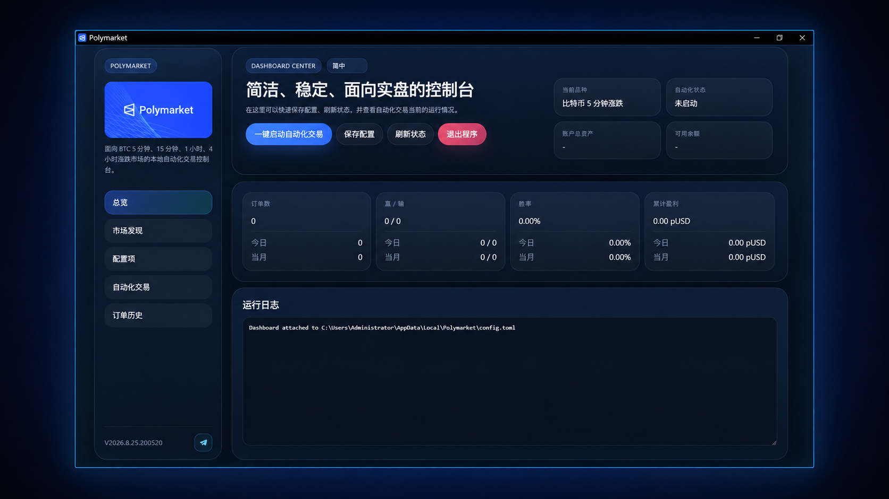
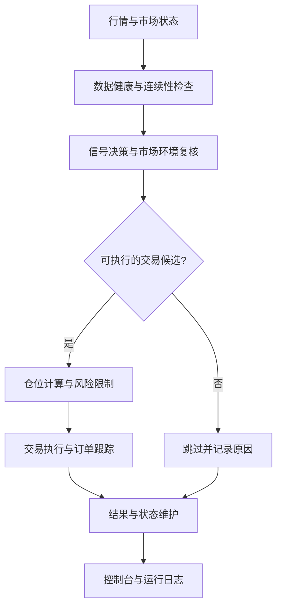

<h1 align="center">Polymarket BTC 5m 自动化交易机器人</h1>

<strong>Polymarket Up / Down · OKX BTCUSDT 永续合约</strong>

以持续自主研发的量化信号策略为核心，面向 Polymarket BTC 5m 与 OKX BTC 合约市场，集成自动交易、风险管理和运行监控。

<strong>简体中文</strong> · <a href="./README_EN.md">English</a>

  
  
  

  <a href="https://github.com/naka2027/polymarket-bot/releases/latest"><strong>下载最新版本</strong></a> ·
  <a href="./docs/zh-CN/quick-start.md"><strong>快速开始</strong></a> ·
  <a href="https://t.me/polymarket_b"><strong>激活授权</strong></a> ·
  <a href="./reports/REPORTS.md"><strong>研究报告</strong></a>

---

## 👀 产品界面

Windows 桌面端 · 中文界面

## ✨ 核心能力

| 核心模块 | 主要能力 |
| --- | --- |
| **自研量化信号策略** | 持续半年以上的策略研究、历史回放与真实市场观察；根据不同市场环境持续迭代，重视适应性与稳定性。 |
| **Polymarket BTC 5m** | 以自研信号策略驱动 BTC 5 分钟 Up / Down 交易，完成信号决策、自动执行与交易结果跟踪。 |
| **OKX BTC 合约** | 独立研发的 BTC 合约量化策略，支持信号判断、自动化执行、仓位维护与风险保护。 |
| **风险管理** | 围绕策略运行实施仓位控制、账户限制、订单校验与异常处理。 |
| **运行与监控** | Windows 桌面端与 Linux / VPS 云端控制台，支持状态查看、日志记录和异常恢复。 |

Polymarket 与 OKX 使用各自的信号策略和交易链路。公开的系统设计参见 [系统架构](./docs/zh-CN/architecture.md) 与 [OKX 策略说明](./docs/zh-CN/okx-strategy.md)。

## 🧩 系统怎样工作

```mermaid
flowchart TD
    A[行情与市场状态] --> B[数据健康与连续性检查]
    B --> C[信号决策与市场环境复核]
    C --> D{可执行的交易候选?}
    D -- 否 --> E[跳过并记录原因]
    D -- 是 --> F[仓位计算与风险限制]
    F --> G[交易执行与订单跟踪]
    G --> H[结果与状态维护]
    E --> H
    H --> I[控制台与运行日志]
```

图示为系统总体流程。Polymarket 与 OKX 的具体运行方式参见 [系统架构](./docs/zh-CN/architecture.md)。

## 🚀 下载与部署

| 运行平台 | 安装方式 |
| --- | --- |
| **Windows 10/11（64 位）** | [下载安装程序](https://github.com/naka2027/polymarket-bot/releases/latest)，运行后按提示完成安装 |
| **Linux x86_64 / VPS** | [查看一键部署命令](./docs/zh-CN/deployment.md)，自动完成云端安装 |

安装完成后，阅读 [快速开始与激活授权](./docs/zh-CN/quick-start.md) 进行首次配置；建议先在模拟模式下验证。详细步骤以 [安装与部署](./docs/zh-CN/deployment.md) 为准。

## 📊 策略研究与历史回放

这里汇总自研策略的**历史回放关键指标**。完整报告还包含年度表现、近期窗口、回撤路径和验证方法。

### Polymarket BTC 5m

两套策略使用相同的 `+4 / -5 / 0` **标准化计分口径**，但历史参与频率和回放区间不同。

| 回放指标 | **V4 Final + L2 Opt** | **Stability Expansion** |
| --- | ---: | ---: |
| 策略定位 | **标准策略 · 实盘建议** | **最新策略 · 未经长期实盘验证，谨慎使用** |
| 历史区间 | 2021-09-01 ～ 2026-09-01 | 2021-09-10 ～ 2026-09-12 |
| 实际参与订单 | **18,285 笔** | **146,846 笔** |
| 历史胜率 | **63.75%** | **63.87%** |
| 标准化净得分 | +13,479 | +109,880 |
| 最大回撤（标准分） | -72 | -88 |
| 最长连续亏损 | 8 笔 | 9 笔 |
| 完整报告 | [标准回放](./reports/BACKTEST_V16.md) | [标准回放](./reports/BACKTEST.md) · [动态仓位与风控回放](./reports/BACKTEST_CAPITAL.md) |

V4 Final + L2 Opt 为当前实盘建议使用的标准策略。Stability Expansion 已有历史回放结果，但尚未经过长期实盘验证。两者参与次数不同，**累计标准化得分不宜直接比较**。

### OKX BTCUSDT 永续合约

**策略重点：控制亏损，让盈利持仓尽可能延续。** 不同于固定结算的 Up/Down 市场，合约交易可以在不利行情中触发保护退出，也可以在行情延续时通过动态保护管理盈利持仓。历史表现因此不仅要看胜率，更要看**盈亏结构、收益路径与回撤**。

**历史执行回放**（2020-07 ～ 2026-09，报告日期：2026-09-23）：**135 笔**完成交易，**78 胜 / 57 负**；以下三种杠杆上限模型基于同一组交易。

| 杠杆上限 | 利润因子（PF） | 理论复投期末权益¹ | 最大已结算回撤 |
| ---: | ---: | ---: | ---: |
| 5× | **4.60** | **98,375.71 USDT** | -22.86% |
| 10× | **5.70** | **7,855,368.80 USDT** | -32.17% |
| 20× | **7.01** | **926,901,132.50 USDT** | -41.60% |

¹ **研究模型，不是实盘收益。** 初始权益为 100 USDT，假设每笔按当时全部策略权益复投，使用历史成交代理和双边 8 bp 成本；未完整模拟真实成交容量、资金费率、强平及滑点。高杠杆同时放大亏损与回撤，理论终值不能直接用于收益预测。

📄 [查看 OKX 合约完整回测：退出结构、年度收益与成本压力（2026-09-23）](./reports/BACKTEST_OKX.md)

> 回放数据是特定日期的研究快照，不是实盘业绩，也不保证未来表现。Polymarket 的标准分、动态仓位模型与 OKX 合约资金回放采用不同口径，不能将结果直接换算或混算。

[**查看全部研究报告 →**](./reports/REPORTS.md)

## 📚 文档导航

| 想了解什么 | 对应文档 |
| --- | --- |
| Windows 安装、云端一键/宝塔部署、反向代理与更新 | [安装与部署](./docs/zh-CN/deployment.md) |
| 安装后的激活、首次配置与实盘建议截图 | [快速开始与激活授权](./docs/zh-CN/quick-start.md) |
| 公开技术框架、系统工作流程 | [系统架构](./docs/zh-CN/architecture.md) |
| 运行监控、故障处理、账户安全、FAQ | [运行维护与安全](./docs/zh-CN/operations-security.md) |
| OKX 策略说明（公开版） | [OKX 策略公开说明](./docs/zh-CN/okx-strategy.md) |
| 所有历史研究报告 | [报告中心](./reports/REPORTS.md) |

完整索引：[文档中心](./docs/zh-CN/README.md) · [版本发布记录](https://github.com/naka2027/polymarket-bot/releases)

## ⚠️ 风险、安全与许可

自动交易和历史回放不保证收益，可能发生部分或全部资金损失。请自行确认平台服务地区、适用法律、交易费用与账户安全要求；本项目与 Polymarket、OKX 官方均无隶属或背书关系。软件不应用于绕过地域限制。

本仓库主要提供公开文档、部署与迁移脚本及正式安装包下载入口，**不包含完整专有策略源码**。权利保留与授权条件见根目录 [`LICENSE`](./LICENSE)；运行中涉及私钥、API Key 和订单状态，请阅读 [安全说明](./docs/zh-CN/operations-security.md)。

问题反馈：[GitHub Issues](https://github.com/naka2027/polymarket-bot/issues) · [Telegram @polymarket_b](https://t.me/polymarket_b)（激活授权与支持）。请勿公开机器码、私钥、API Key、Token 或未脱敏日志。
