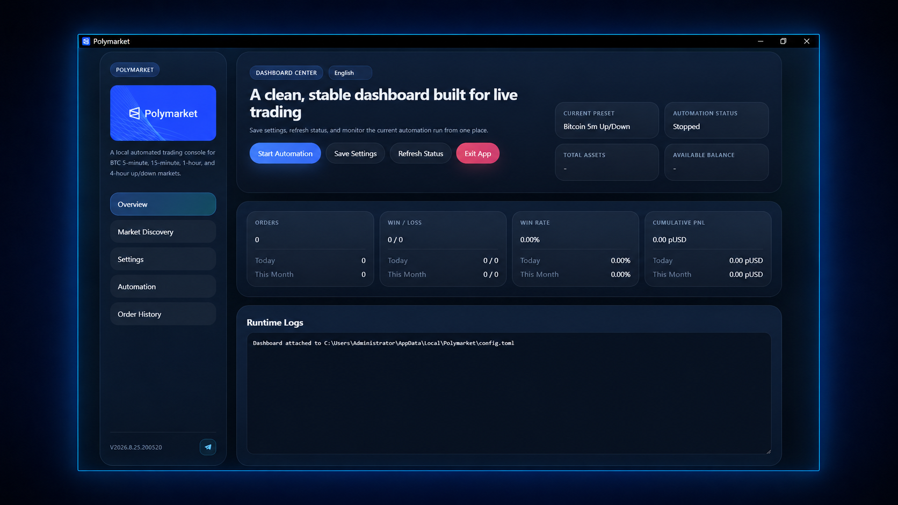
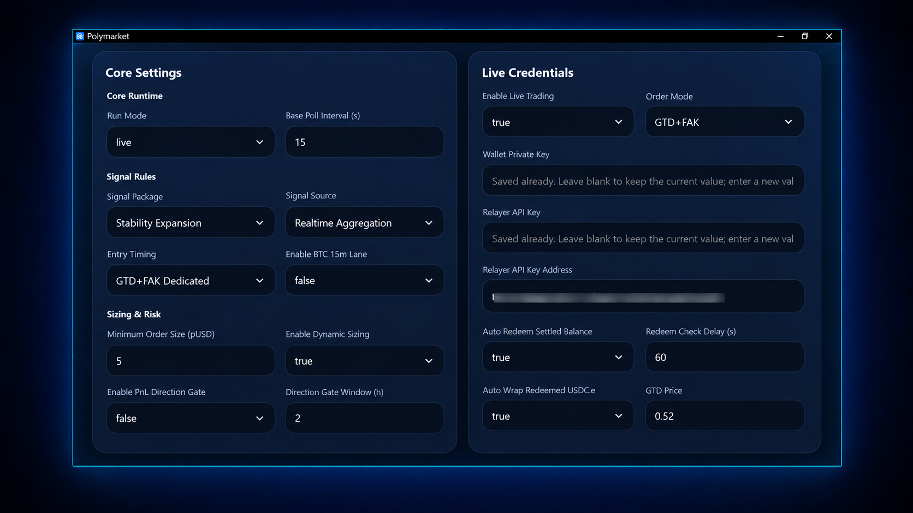

# Polymarket BTC 5m Automated Trading Bot

[简体中文](./README.md) | **English**

[Download the latest release](../../releases/latest) · [View public replay reports](./REPORTS_EN.md) · [Request a trial](https://t.me/polymarket_b)

**A fully automated quantitative trading system built specifically for Polymarket BTC 5-minute Up or Down markets: its independently developed signal strategy determines direction, while the system handles sizing, risk controls, order execution, and tracking on Windows or self-hosted Linux.**

> **Before you use it**
>
> This is independently developed third-party software and is not affiliated with, authorized by, or endorsed by Polymarket. Automated trading does not guarantee profit. Check the rules that apply in your region and use only capital you can afford to lose.



## Contents

1. [Strategy core and historical behavior](#1-strategy-core-and-historical-behavior)
2. [Signal strategy, risk, and dynamic-sizing architecture](#2-signal-strategy-risk-and-dynamic-sizing-architecture)
3. [How automation turns the strategy into a closed loop](#3-how-automation-turns-the-strategy-into-a-closed-loop)
4. [First-time use](#4-first-time-use)
5. [Installation and deployment](#5-installation-and-deployment)
6. [What to watch while it runs](#6-what-to-watch-while-it-runs)
7. [Credentials, security, and privacy](#7-credentials-security-and-privacy)
8. [FAQ and support](#8-faq-and-support)
9. [Risk disclosure and License](#9-risk-disclosure-and-license)

## 1. Strategy core and historical behavior

We developed this strategy independently over six months and continue to validate and refine it through historical replay and the latest market data. Several signal families work together: they first identify conditions such as trend continuation, momentum exhaustion, and structural reversal, then review each candidate through its independently maintained shadow state, the current market regime, and post-signal rules. The result is to keep the direction, adjust it, or skip the market. Once direction is settled, dynamic sizing and risk controls use account capital, recent performance, and account conditions to determine the order amount and whether it should be executed.

### Public historical evidence

We preserve separate reports for historical and current releases instead of overwriting older results. The three reports answer different questions:

| Report | Purpose | Key snapshot |
| --- | --- | --- |
| [Stability Expansion Current strategy standardized replay](./BACKTEST_EN.md) | Measures signal direction quality and its historical risk path | 146,846 orders, 63.87%, standardized Score +109,880 |
| [Stability Expansion Dynamic sizing and risk replay](./BACKTEST_CAPITAL_EN.md) | Illustrates a capital path on the same current signal set | 400 pUSD initial capital and 21,273,734.6 pUSD ending capital; see methodology and limitations |
| [V4 Final + L2 Opt V16 release](./BACKTEST_V16_EN.md) | Preserves a traceable result for the older strategy version | 18,285 orders, 63.75%, standardized Score +13,479 |

The standardized replay uses fixed `+4/-5` scoring to compare signal quality. The capital replay additionally applies dynamic sizing and common risk controls. These results cannot be combined directly, and neither is a live-account return. See the [public replay report center](./REPORTS_EN.md) for full methodology, annual and recent results, and limitations.

The latest **Stability Expansion** strategy package has not yet undergone extensive long-term validation. We recommend running it in simulation mode first to verify that its strategy state, signal performance, and overall stability meet expectations before considering live trading based on your own risk tolerance.

For live trading, we recommend using the **V4 Final + L2 Opt V16** strategy package with the recommended configuration. This does not constitute any guarantee or promise of future returns.

## 2. Signal strategy, risk, and dynamic-sizing architecture

The full decision path can be summarized as:

```text
Closed market data and currently available state
                    ↓
         Continuity and freshness checks
                    ↓
 Continuation     Exhaustion/reversal     Structure/regime
        └─── multiple native signal families create candidates ───┘
                    ↓
           Each family's independent shadow state
                    ↓
      Volatility, local structure, and repeat-trigger review
                    ↓
        Arbitration: one direction or no participation
                    ↓
              Fixed or dynamic sizing
                    ↓
      Account, balance, limit, duplicate, and execution risk
                    ↓
                Place or block the order
```

The order matters. Signals answer "which direction?" State and regime checks ask "is this instance still trustworthy?" Sizing decides "how much exposure is allowed?" Final execution checks decide "can the order be placed safely now?"

### How signals are formed

Each target market receives one final result: keep the candidate direction, adjust it, or skip the window. The decision uses only market data and strategy state that already exist at that point in time.

The native signal first answers: "what kind of tradable structure is present now?" It proposes a base direction but does not directly become the final order.

- **Trend and continuation candidates** look for persistent and efficient movement and ask whether close and trade structure still support continuation;
- **Exhaustion and reversal candidates** look for overextended movement, falling efficiency, and disagreement between the original direction and the close, wick, or trade structure;
- **Structure and regime candidates** separate directional breakouts from isolated wicks, failed breakouts, persistent low-volatility noise, and sudden volatility transitions.

Candidates combine directional persistence, price efficiency, volatility regime, candle and close structure, momentum exhaustion, trade structure, and recent trigger density. No single input determines the final direction on its own.

### Market regime and candidate arbitration

The same price move means something different after a long low-volatility base, inside persistent high volatility, or during noisy consolidation.

The regime layer decides whether continuation, reversal, or temporary avoidance fits the current environment, and whether a native candidate should be kept, downgraded, adjusted, or stopped.

Continuation and reversal candidates may appear in the same market window. Each candidate retains its source, base direction, dependent shadow state, and post-signal rules before deterministic conflict and priority relationships produce one result. An adjustment applies only to the current candidate; if no unique trustworthy result remains, the bot does not trade that window.

### Shadow states: a separate record for each signal family

Think of a shadow as a separate performance state for one signal family. If that family weakens in the current market, only the rules that depend on it are affected; other ready signal families can still be evaluated normally.

A shadow does not simply look at whether the live account just won or lost and reverse the whole strategy. It advances chronologically through completed events for the relevant signal whose results could already be confirmed at that time.

- Shadows advance chronologically;
- A shadow affects only strategy components that depend on it and should not unconditionally block unrelated families;
- It may keep, adjust, pause, or retain conditional candidates;
- It is not an additional live order and does not increase size to chase account losses;
- It does not download and replay the full history before every order.

### Post-signal rules handle "the signal exists, but this is not the right moment to trade it unchanged"

Passing a native signal and shadow state does not guarantee an order. Post-signal rules handle sudden local-structure changes, extremely low or high volatility, volatility transitions, crowded triggers, and structural changes that occur after the original candidate first appears.

They modify only the matching candidate rather than rewriting unrelated signals. The result can be to keep the base direction, adjust that candidate, or STOP it.

### Dynamic sizing scales order size with account capital

Fixed sizing uses the configured amount for every order while remaining subject to platform minimums, available balance, daily count, and daily-notional limits.

Dynamic sizing is calculated independently after final direction is settled. It uses the latest available balance together with recent strategy performance. As account capital grows and performance remains stable, the target order amount increases gradually so profitable phases can make fuller use of the larger capital base.

When changing market conditions move the strategy into drawdown or a loss streak, order size is reduced to limit erosion of accumulated gains. As performance recovers, size is restored progressively and can return to its growth phase.

This process remains bounded by the base target, per-order cap, safety reserve, platform minimums, and actual available funds. Dynamic sizing changes order amount rather than signal direction and never increases size simply to chase losses.

### Layered risk controls

| Risk layer | Main checks |
| --- | --- |
| Signal | Valid direction, shadow state, market regime, conflict arbitration |
| Position size | Fixed/dynamic size, per-order cap, safety reserve, rolling performance |
| Account | Mode, live switch, credentials, balance, allowance, and daily limits |
| Execution | Target market, entry window, duplicate prevention, order mode, and book conditions |
| Runtime | Feed fallback, data repair, retry, logs, supervisor, and watchdog |

These mechanisms can limit exposure but cannot eliminate directional losses, loss streaks, slippage, liquidity, network, or third-party API risk.

### How we check replay against production logic

A strategy decision may use only information that existed at its decision time. Historical replay and runtime state advance chronologically. The unresolved result of the current target market cannot be inserted into the current decision, and a shadow can be updated only by completed events whose results can already be confirmed.

Internal acceptance after an update examines per-event timing, target windows, source, base direction, post-signal action, final direction, STOP outcomes, annual/monthly/weekly behavior, drawdown, loss streaks, data continuity, and per-event equivalence across unchanged periods. These checks are designed to reduce future-data use, timing errors, state contamination, and drift between research and production code, but they are not an independent third-party audit.

Public documentation does not disclose indicator formulas, historical windows, thresholds, weights, directional mappings, branch triggers, or internal priority parameters.

## 3. How automation turns the strategy into a closed loop

The automation layer applies the strategy's data timing, signal arbitration, sizing, risk, and order rules, and handles order tracking, recovery, result records, and optional position redemption.

### From startup to the next target window

```text
Start the application and restore persisted state
          ↓
Discover and validate the target market and window
          ↓
Maintain Binance and Polymarket market data
          ↓
Check candle continuity, data freshness, and shadow readiness
          ↓
Native signal → relevant shadow state → regime and post-signal rules
          ↓
Merge into one final direction, or skip the current window
          ↓
Calculate fixed/dynamic size and apply layered risk controls
          ↓
Execute GTD, FAK, or a configured combination
          ↓
Track submission, resting, fill, partial fill, and failure states
          ↓
Confirm the trade state and wait for the target-market result
          ↓
Record outcome, PnL, triggering branch, and decision reason
          ↓
Optionally redeem eligible positions and maintain usable balance
          ↓
Persist state, watermarks, and logs
          ↓
Continue into the next target market
```

When no valid signal exists, required state is not ready, or risk and execution conditions are not met, the bot skips the current window and records the reason in status or logs.

## 4. First-time use

### Recommended path

```text
Download and verify the build from Releases
        ↓
Start the application and request a trial
        ↓
Complete the basic settings
        ↓
Wait for required shadow states to finish preparation
        ↓
Check market data, target market, account, size, and status
        ↓
Start automation and review its runtime status
```

### Download and integrity verification

Download official builds only from this repository's [Releases](../../releases/latest):

```text
PolymarketSetup.exe
PolymarketCloud-linux-x64-centos7.tar.gz
```

GitHub's automatically generated `Source code (zip)` and `Source code (tar.gz)` archives contain only the public documentation in this distribution repository. They are not application source code and are not runnable builds.

Windows:

```powershell
Get-FileHash .\PolymarketSetup.exe -Algorithm SHA256
```

Linux:

```bash
sha256sum ./PolymarketCloud-linux-x64-centos7.tar.gz
```

Compare the complete result with the SHA-256 shown on the Release page. Do not use unverified file-sharing links, group uploads, or mirrors. If Windows shows an unknown-publisher or SmartScreen warning, verify both the source and checksum before proceeding.

### Trial and activation

The first launch displays a device code. Send it to [Telegram @polymarket_b](https://t.me/polymarket_b) to request a trial activation code. Authorization is associated with the current device; duration and scope follow the issued license. Never post a device code, wallet credential, or account information in GitHub Issues.

### Complete the basic setup

After first launch, open Settings in the dashboard, choose the run mode, signal package, sizing, and risk limits, then select Save Settings. Sensitive credentials are encrypted locally.

### Basic configuration guidance

| Setting | First-use recommendation | Explanation |
| --- | --- | --- |
| Current market | Default BTC 5-minute market | Primary market for the current core strategy |
| Signal package | `V4 Final + L2 Opt` | The current strategy selection for this release |
| Entry timing | Post-close confirmation | Pre-close and GTD+FAK require stronger timing, network, and order-state reliability |
| Size | Set according to capital scale and risk preference | Inspect Current Order Size before enabling dynamic sizing |
| Daily count/notional | Conservative limits | Caps daily order count and total exposure |
| Auto redemption/balance maintenance | Off initially | Enable only after separate validation |

> Select `V4 Final + L2 Opt` in the current release.

### Entry timing and order modes

**Post-close confirmation** waits for the reference candle to close and uses confirmed structure for the next window. It is more stable but decides and submits later.

**Pre-close estimation** evaluates the maintained real-time aggregate near candle close. It can enter earlier, but the final seconds may still change.

**Dedicated GTD+FAK** first uses a GTD limit order to seek a fill, then evaluates actual fill state and remaining target amount at handoff before optionally using FAK. It includes remaining-size calculation, cancellation, fill confirmation, and recovery.

### First shadow preparation

After a fresh installation, first use of a relevant strategy, or an upgrade that requires rebuilding state, one or more shadows may show Preparing. The application retrieves required closed history, validates continuity, repairs recoverable gaps, rebuilds shadows chronologically, and publishes the state only after validation.

Keep the application running with a stable network. Start automation only after no required item in the strategy-status area or hover details shows Preparing or Error.

After first preparation, normal maintenance processes new closed candles and repairs discontinuities rather than rebuilding the full history every cycle.

If preparation remains stuck, check Binance and Polymarket connectivity, status details, fault logs, disk space, and system time. Avoid repeatedly killing the process. Contact [Telegram @polymarket_b](https://t.me/polymarket_b) if recovery still fails.

### Recommended configuration reference

Use the screenshot below to locate the relevant settings. Follow the defaults in the current application and Release notes; do not copy addresses or credentials shown in examples.



| Setting | Reference baseline |
| --- | --- |
| Run mode | `live` |
| Base poll interval | 15 seconds |
| Signal package | `V4 Final + L2 Opt` |
| Data source | Realtime aggregation |
| Entry timing/order mode | GTD+FAK Dedicated / GTD+FAK |
| Minimum order | 5 pUSD |
| Dynamic sizing | Inspect Current Order Size before enabling |
| PnL direction gate | **Off by default** |
| Daily order count/notional | 48 / 240 pUSD; reduce according to personal risk tolerance |
| Auto redemption/balance conversion | Enable only after separately validating credentials and allowances |
| Redemption delay/GTD price | 60 seconds / 0.52 |

> **Use the PnL direction gate with caution**
>
> This is not a conventional stop-loss and does not merely block one order. When enabled, it uses the confirmed result of the previous complete rotation period to lock the current complete period into inherited or globally reversed direction. If the prior period is incomplete, the gate may wait and skip trading. It can change the final strategy direction and should remain off by default; enable it as needed after understanding period boundaries, result completeness, and global reversal.

## 5. Installation and deployment

### Edition comparison

| Item | Windows desktop | Linux cloud |
| --- | --- | --- |
| Interface | Local desktop dashboard | Browser-based Web dashboard |
| Best suited for | Local use and direct monitoring | Long-running VPS and remote management |
| Paper/live | Supported | Supported |
| Config and state | Brand-specific local application-data directory | Deployment config and state directories |
| Process supervision | Desktop application lifecycle | supervisor, watchdog, and external guard |
| Management endpoint | Desktop window | `127.0.0.1:8765` by default |

Both editions support 简体中文, English, 日本語, 한국어, Español, Français, and Deutsch; this repository provides complete Chinese and English documentation.

### System requirements

Windows: 64-bit Windows 10/11, write access to the application-data directory, working time synchronization, and connectivity to Binance, Polymarket, and Polygon RPC.

Linux: x86_64, with Ubuntu LTS recommended for deployment. The deployment user needs read/write access to program, state, and log directories, together with connectivity to Binance, Polymarket, and Polygon RPC. Support for other Linux distributions follows the corresponding Release notes.

Choose the server region and outbound network according to Polymarket's latest supported regions and applicable rules. Keep system time synchronized, maintain sufficient disk space, and do not let multiple instances share one state directory.

### Windows quick start

Download, verify, and install `PolymarketSetup.exe`. After launch, follow the first-time-use path for activation, configuration, shadow preparation, and automation startup.

### Linux cloud quick deployment

The cloud archive normally contains:

```text
PolymarketCloud
PolymarketCloud.integrity.json
bt-cloud-guard.sh
CLOUD_DEPLOYMENT_CN.md
```

```bash
mkdir -p /www/wwwroot/polymarket-cloud
tar -xzf /path/to/PolymarketCloud-linux-x64-centos7.tar.gz \
  -C /www/wwwroot/polymarket-cloud
cd /www/wwwroot/polymarket-cloud
chmod +x ./PolymarketCloud ./bt-cloud-guard.sh
bash ./bt-cloud-guard.sh
```

Always start through `bt-cloud-guard.sh`; do not directly supervise an internal worker. On first Web access, complete activation and administrator initialization, save the configuration from Settings, and inspect shadow preparation.

Cloud credentials are encrypted locally on the server. The dashboard listens on `127.0.0.1:8765` by default. Production access should use an HTTPS domain and Nginx/control-panel reverse proxy. Never expose an unprotected management port to the public Internet.

See the deployment guide inside the cloud archive for process-supervision, HTTPS, and update procedures.

## 6. What to watch while it runs

### What to monitor during operation

- Whether automation is Running, Stopped, or in Error;
- Whether the target market and window are correct;
- Whether market data is fresh and continuous or a fallback is active;
- Whether required shadows are ready;
- Current order size, daily count, and daily notional;
- Whether each order is submitting, resting, partially filled, filled, cancelled, or failed;
- Whether the market result is confirmed and positions are redeemable;
- Whether logs contain persistent network, data, account, or disk faults.

You do not need to operate every trade, but the status details, order history, and logs should make it clear why the bot traded or skipped a window.

### Faults and recovery

- A fallback path is used when the real-time feed is unhealthy;
- Historical discontinuities trigger targeted repair;
- Shadow-maintenance faults are recorded and retried;
- Linux supervisor, watchdog, and external guard provide process-level recovery;
- Order-maintenance and redemption faults do not create new trading signals.

A restarted process does not imply that every external open order disappeared. After abnormal restart, inspect both application order history and the Polymarket account.

### Updates and recovery

On Windows, stop automation and fully exit the application, then run the new installer directly over the existing installation. After reopening, inspect settings and strategy state. If the release triggers a shadow rebuild, wait until required states are ready before starting automation.

On Linux, stop automation, stop the guard process, replace the cloud program files, and then restart the guard. Preserve existing settings, order history, and state data while replacing the files.

## 7. Credentials, security, and privacy

The software does not custody funds. Trading signatures are created on your own computer or server, assets remain in your wallet and Polymarket account, and live private keys and Relayer API Keys are protected by local encryption.

### Live credentials

The Polymarket live configuration requires only three fields in the dashboard:

- Wallet private key;
- Relayer API Key;
- Relayer API Key Address.

The wallet private key and Relayer API Key are encrypted on the Windows device or Linux server. The Relayer API Key Address is not a private key, but should still be hidden in public screenshots.

## 8. FAQ and support

### Why should automation not start immediately after first launch?

Some strategies must prepare historical shadow state. Start only after no required item shows Preparing or Error. A shadow showing Off can be valid and does not need to become On.

### Why did the bot place no order?

The strategy may have skipped the window, preparation may be incomplete, risk controls may have blocked the order, or an external condition may have failed. Inspect the current status, order history, and logs together.

### Does closing the application cancel every order?

Not necessarily. Closing a page, stopping automation, or killing the process does not guarantee that every external order or position has been cancelled or completed. Inspect the application and Polymarket account afterward.

### Why can actual fills differ from replay results?

Live orders are affected by the order book, fill price, latency, slippage, partial fills, fees, and API state. Pre-close estimation may also differ from the final closed structure. The strategy primarily references Binance market data, while the final Polymarket result follows the rules and designated source shown on the corresponding market page.

### Can the application bypass geographic restrictions?

No. It is not designed to bypass platform geographic restrictions, account restrictions, compliance obligations, or applicable law.

### How to request support

Use GitHub Issues or [Telegram @polymarket_b](https://t.me/polymarket_b). Include the software version, operating system, current run mode, occurrence time, redacted logs, reproduction steps, and screenshots.

Before submitting, remove or obscure private keys, seed phrases, Relayer API Keys and addresses, server and administrator passwords, cookies, and tokens.

## 9. Risk disclosure and License

This application is provided solely as an automation and technical tool. It is not investment, financial, or legal advice and does not promise returns.

Prediction-market and digital-asset trading may cause partial or total capital loss because of directional errors, loss streaks, rapid markets, insufficient liquidity, slippage, fees, order failures, network outages, API changes, resolution-data differences, credential compromise, server faults, software defects, geographic restrictions, or regulatory changes.

Users should commit only capital they can afford to lose completely and remain fully responsible for all trading decisions and results.

All relevant rights in the distributed builds, application, and documentation are reserved. Unless separately authorized in writing, reverse engineering, cracking, modification, resale, mirror distribution, or other infringement is prohibited.
