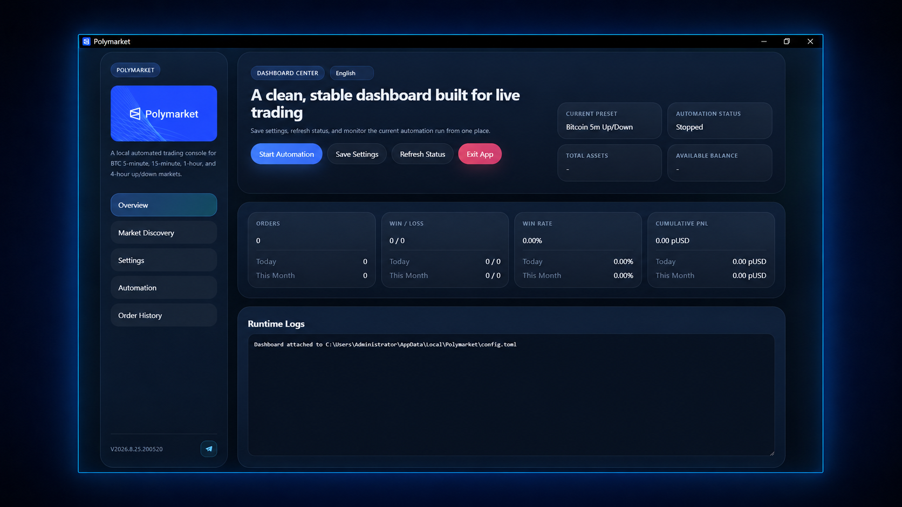
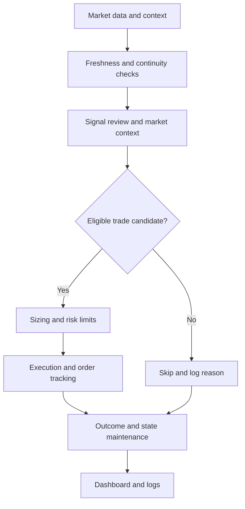

<h1 align="center">Polymarket BTC 5m Automated Trading Bot</h1>

<strong>Polymarket Up / Down · OKX BTCUSDT Perpetual</strong>

A research-driven automated trading system built around independently developed quantitative signal strategies for Polymarket BTC 5m and OKX BTC futures, with execution, risk management, and runtime monitoring.

<a href="./README.md">简体中文</a> · <strong>English</strong>

  
  
  

  <a href="https://github.com/naka2027/polymarket-bot/releases/latest"><strong>Latest release</strong></a> ·
  <a href="./docs/en/quick-start.md"><strong>Quick start</strong></a> ·
  <a href="https://t.me/polymarket_b"><strong>Activation &amp; licensing</strong></a> ·
  <a href="./reports/REPORTS_EN.md"><strong>Research reports</strong></a>

---

## 👀 Product interface

Windows desktop · English interface

## ✨ Core capabilities

| Core module | Capabilities |
| --- | --- |
| **Proprietary quantitative signal strategies** | Over six months of continuous research, historical replay, and live-market observation, with ongoing iteration focused on adaptability and stability across market conditions. |
| **Polymarket BTC 5m** | Research-driven signal decisions, automated execution, and outcome tracking for BTC 5-minute Up / Down markets. |
| **OKX BTC futures** | An independently developed BTC futures signal strategy with automated execution, position maintenance, and risk protection. |
| **Risk management** | Position controls, account limits, order validation, and runtime exception handling around each strategy. |
| **Operations & monitoring** | Windows desktop and Linux/VPS cloud dashboards, status monitoring, logs, and fault recovery. |

Polymarket and OKX have separate strategy and execution paths. See the [public system architecture](./docs/en/architecture.md) and [OKX strategy overview](./docs/en/okx-strategy.md).

## 🧩 How it works

```mermaid
flowchart TD
    A[Market data and context] --> B[Freshness and continuity checks]
    B --> C[Signal review and market context]
    C --> D{Eligible trade candidate?}
    D -- No --> E[Skip and log reason]
    D -- Yes --> F[Sizing and risk limits]
    F --> G[Execution and order tracking]
    G --> H[Outcome and state maintenance]
    E --> H
    H --> I[Dashboard and logs]
```

This diagram shows the general workflow. For the separate Polymarket and OKX execution paths, see [System Architecture](./docs/en/architecture.md).

## 🚀 Download & Deploy

| Platform | Installation |
| --- | --- |
| **Windows 10/11 (64-bit)** | [Download the installer](https://github.com/naka2027/polymarket-bot/releases/latest), run it, and follow the prompts |
| **Linux x86_64 / VPS** | [One-command cloud deployment](./docs/en/deployment.md) |

After installation, follow [Quick Start & Activation](./docs/en/quick-start.md) for first-time setup. Paper-mode validation is recommended before live use. See [Installation & Deployment](./docs/en/deployment.md) for the steps.

## 📊 Strategy research & historical replays

A compact overview of **historical replay results** for the independently developed strategies. Full reports cover yearly performance, recent windows, drawdown paths, and validation methods.

### Polymarket BTC 5m

Both strategies use the same **standardized `+4 / -5 / 0` scoring convention**, but their participation rates and historical intervals differ.

| Replay metric | **V4 Final + L2 Opt** | **Stability Expansion** |
| --- | ---: | ---: |
| Positioning | **Standard · Recommended for live trading** | **Latest · Long-term live validation pending · Use with caution** |
| Historical period | 2021-09-01 to 2026-09-01 | 2021-09-10 to 2026-09-12 |
| Executed selections | **18,285** | **146,846** |
| Historical win rate | **63.75%** | **63.87%** |
| Standardized net score | +13,479 | +109,880 |
| Max drawdown (score points) | -72 | -88 |
| Longest losing streak | 8 trades | 9 trades |
| Full reports | [Standardized replay](./reports/BACKTEST_V16_EN.md) | [Standardized replay](./reports/BACKTEST_EN.md) · [Dynamic sizing & risk replay](./reports/BACKTEST_CAPITAL_EN.md) |

V4 Final + L2 Opt is the current standard strategy recommended for live use. Stability Expansion has historical replay results but has not yet undergone long-term live validation. Participation volume differs, so **cumulative standardized scores should not be compared directly**.

### OKX BTCUSDT perpetual futures

**Strategy focus: limit downside and allow profitable positions to run.** Unlike a market with a fixed Up/Down settlement, futures positions can exit when protective conditions are triggered or remain open as a trend develops, with dynamic protection managing the position. The important measures are therefore **profit/loss structure, return path, and drawdown**—not win rate alone.

**Historical execution replay** (Jul 2020 – Sep 2026; report dated Sep 23, 2026): **135 completed trades**, **78 wins / 57 losses**. The three leverage-cap models below replay the same trades.

| Leverage cap | Profit Factor (PF) | Theoretical ending equity¹ | Max closed-equity drawdown |
| ---: | ---: | ---: | ---: |
| 5× | **4.60** | **98,375.71 USDT** | -22.86% |
| 10× | **5.70** | **7,855,368.80 USDT** | -32.17% |
| 20× | **7.01** | **926,901,132.50 USDT** | -41.60% |

¹ **Research model, not live returns.** Starting equity is 100 USDT, with each trade theoretically compounding all current strategy equity, historical execution proxies, and 8 bp round-trip costs. Real market capacity, funding, liquidation, and slippage are not fully modeled. Higher leverage also magnifies losses and drawdowns; theoretical ending equity is not a return forecast.

📄 [Full OKX futures replay: exit structure, yearly returns & cost sensitivity (Sep 23, 2026)](./reports/BACKTEST_OKX_EN.md)

> These are dated research snapshots, not live trading results or guarantees of future performance. Polymarket standardized scores, dynamic capital simulations, and OKX futures replays use different methodologies and must not be converted or combined as if they were equivalent.

[**Explore all research reports →**](./reports/REPORTS_EN.md)

## 📚 Documentation

| Topic | Document |
| --- | --- |
| Windows installation, Linux / BT Panel deployment, HTTPS proxying & updates | [Installation & Deployment](./docs/en/deployment.md) |
| Post-install activation, configuration and reference live-settings screenshot | [Quick Start & Activation](./docs/en/quick-start.md) |
| Public system design and runtime flow | [System Architecture](./docs/en/architecture.md) |
| Runtime monitoring, troubleshooting, credentials and FAQ | [Operations & Security](./docs/en/operations-security.md) |
| Public OKX strategy design | [OKX Strategy Overview](./docs/en/okx-strategy.md) |
| Historical strategy and futures research | [Report Center](./reports/REPORTS_EN.md) |

[Documentation hub](./docs/en/README.md) · [Release history](https://github.com/naka2027/polymarket-bot/releases)

## ⚠️ Risk, security & license

Automated trading and backtests do not guarantee returns. You may lose part or all of your funds. Check platform access rules, applicable law, trading costs, and credential security. This independent project is not affiliated with or endorsed by Polymarket or OKX and cannot be used to bypass geographic restrictions.

This repository publishes documentation, installer/migration scripts, and official binary-release links, **not the full proprietary strategy source code**. See the root [`LICENSE`](./LICENSE) for reserved rights and permitted access, and read the [security guide](./docs/en/operations-security.md) before configuring credentials.

Support: [GitHub Issues](https://github.com/naka2027/polymarket-bot/issues) · [Telegram @polymarket_b](https://t.me/polymarket_b) (activation and support). Never publish device codes, private keys, API keys, tokens, or unredacted logs.
