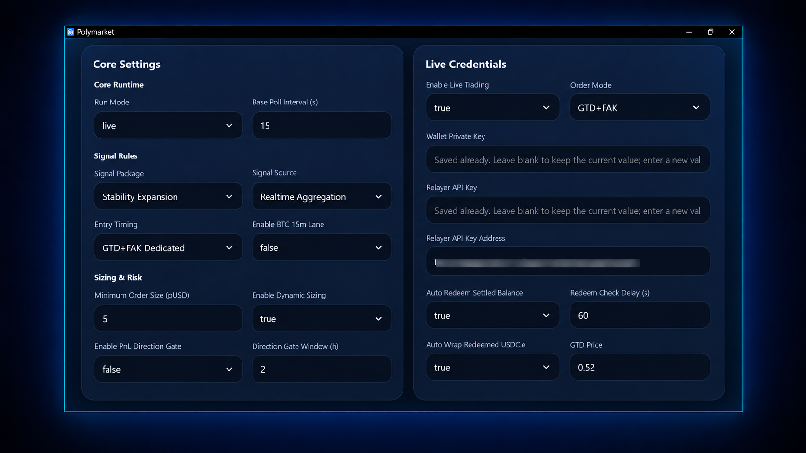

# Quick Start · Activation & Initial Setup

[← Overview](../../README_EN.md) · [Installation & Deployment](./deployment.md) · [Documentation](./README.md)

This guide starts **after the application has been installed and can launch**. If not yet installed, follow [Installation & Deployment](./deployment.md): download and install on Windows or use the one-command installer on Linux / VPS. For existing cloud deployments, follow the appropriate Release notes.

> Validate the system in paper mode before considering live trading. The live-settings screenshot below is a reference for locating controls, not a recommended first-launch configuration.

## After installation

1. Launch the Windows app or open the deployed Linux Web dashboard.
2. Complete device activation and licensing. Cloud users should also initialize the administrator account as prompted.
3. Save the basic settings, select paper mode, and set appropriate risk limits.
4. Wait for required strategy states to become ready; check market data, account, and position status.
5. Observe signals, order handling, and logs in paper mode before deciding whether to trade live.

### Activation and licensing

The first launch displays a device code. Send it to [Telegram @polymarket_b](https://t.me/polymarket_b) to request activation authorization. Authorization is associated with the current device; duration and scope follow the issued license. Never post a device code, wallet credential, or account information in GitHub Issues.

### Complete the basic setup

After first launch, open Settings in the dashboard, choose the run mode, signal package, sizing, and risk limits, then select Save Settings. Sensitive credentials are encrypted locally.

### OKX BTC Futures: first-use checks

OKX futures uses its own signal strategy and automated execution path. Before enabling `BTC-USDT-SWAP` for the first time, check the following:

| Item | What to verify |
| --- | --- |
| Trading account | Confirm the OKX account or sub-account, required trading permissions, and account mode for this instrument. |
| Existing positions and orders | Review open `BTC-USDT-SWAP` positions, regular orders, conditional orders, and protective stop/take-profit orders. Decide how existing activity will be handled. |
| Trading and risk settings | Check margin and leverage settings, available balance, position sizing, and risk limits. Configure the options supported by your installed version. |
| Operational status | Observe signals and order handling in paper mode first. If live automation is enabled, verify that positions, orders, and protective orders agree with the dashboard. |

**Account-management scope:** Once live automation is enabled, the system exclusively maintains `BTC-USDT-SWAP` positions and associated orders in the selected account. During reconciliation or recovery, it may cancel orders inconsistent with current state or rebuild protection. Avoid simultaneous manual trading or another bot managing the same instrument in that account; a dedicated account or sub-account can be used.

For more context, see the [OKX BTC Futures strategy overview](./okx-strategy.md).

### Polymarket BTC 5m: first-time setup (paper mode)

| Setting | First-use recommendation | Explanation |
| --- | --- | --- |
| Current market | Default BTC 5-minute market | Primary market for the current core strategy |
| Signal package | `V4 Final + L2 Opt` | A strategy option in this documented release; verify against the installed build |
| Entry timing | Post-close confirmation | Pre-close and GTD+FAK require stronger timing, network, and order-state reliability |
| Size | Set according to capital scale and risk preference | Inspect Current Order Size before enabling dynamic sizing |
| Daily count/notional | Conservative limits | Caps daily order count and total exposure |
| Auto redemption/balance maintenance | Off initially | Enable only after separate validation |

> Available strategy options depend on the installed software version.

### Entry timing and order modes

**Post-close confirmation** waits for the reference candle to close and uses confirmed structure for the next window. It is more stable but decides and submits later.

**Pre-close estimation** evaluates the maintained real-time aggregate near candle close. It can enter earlier, but the final seconds may still change.

**Dedicated GTD+FAK** first uses a GTD limit order to seek a fill, then evaluates actual fill state and remaining target amount at handoff before optionally using FAK. It includes remaining-size calculation, cancellation, fill confirmation, and recovery.

### First shadow preparation

After a fresh installation, first use of a relevant strategy, or an upgrade that requires rebuilding state, one or more shadows may show Preparing. The application retrieves required closed history, validates continuity, repairs recoverable gaps, rebuilds shadows chronologically, and publishes the state only after validation.

Keep the application running with a stable network. Start automation only after no required item in the strategy-status area or hover details shows Preparing or Error.

After first preparation, normal maintenance processes new closed candles and repairs discontinuities rather than rebuilding the full history every cycle.

If preparation remains stuck, check Binance and Polymarket connectivity, status details, fault logs, disk space, and system time. Avoid repeatedly killing the process. Contact [Telegram @polymarket_b](https://t.me/polymarket_b) if recovery still fails.

### Live settings reference

The screenshot and table below illustrate a live-trading configuration. Start with paper-mode validation, and use the settings supported by your installed version.

| Setting | Reference baseline |
| --- | --- |
| Run mode | `live` (**only after separate verification and an explicit decision to trade live**) |
| Base poll interval | 15 seconds |
| Signal package | `V4 Final + L2 Opt` |
| Data source | Realtime aggregation |
| Entry timing/order mode | Trade After Close / FAK |
| Minimum order | 5 pUSD |
| Dynamic sizing | Inspect Current Order Size before enabling |
| PnL direction gate | **Off by default** |
| Daily order count/notional | 48 / 240 pUSD; reduce according to personal risk tolerance |
| Auto redemption/balance conversion | Enable only after separately validating credentials and allowances |
| Redemption delay/GTD price | 60 seconds / 0.52 |

> **Use the PnL direction gate with caution**
>
> This is not a conventional stop-loss and does not merely block one order. When enabled, it uses the confirmed result of the previous complete rotation period to lock the current complete period into inherited or globally reversed direction. If the prior period is incomplete, the gate may wait and skip trading. It can change the final strategy direction and should remain off by default; enable it as needed after understanding period boundaries, result completeness, and global reversal.
