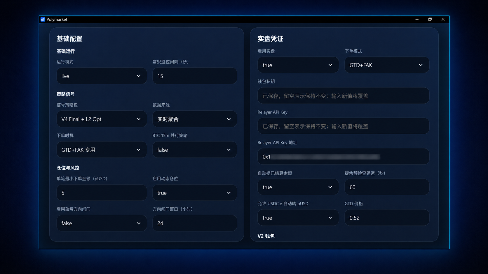

# 快速开始 · 激活授权与首次配置

[← 首页](../../README.md) · [安装与部署](./deployment.md) · [文档目录](./README.md)

本指南适用于**已经完成安装、能够启动程序**的用户。尚未安装？Windows 下载安装即可，Linux / VPS 可通过一条命令部署。请先阅读 [安装与部署](./deployment.md)。已有云端版本升级或迁移请按对应 Release 说明操作。

> 建议先在模拟模式核验，再自行决定是否启用实盘。下方实盘配置截图用于参考设置项，并非首次启动时的推荐配置。

## 安装后的首次使用

1. 启动 Windows 客户端或打开已经部署好的 Linux Web 控制台。
2. 完成设备激活授权；云端用户按安装界面的提示完成管理员初始化。
3. 保存基础配置，先选择模拟运行并设置合适的风险限制。
4. 等待必要的策略状态准备完成，检查行情、账户和仓位状态。
5. 在模拟模式下观察信号、订单处理及日志，再评估是否进行实盘交易。

### 激活授权

首次启动会显示设备机器码。通过 [Telegram @polymarket_b](https://t.me/polymarket_b) 提交机器码并申请激活授权。授权与当前设备关联，期限和范围以签发信息为准。不要在 GitHub Issues 中公开机器码、钱包凭证或账户信息。

### 完成基础设置

首次启动后，在控制台的“配置项”页面完成运行模式、策略包、仓位和风险上限等设置，然后点击“保存配置”。敏感凭证会在本地加密保存。

### OKX BTC 合约：首次使用检查

OKX 合约采用独立的信号与自动化交易链路。首次启用 `BTC-USDT-SWAP` 前，请检查：

| 检查项目 | 需要确认的内容 |
| --- | --- |
| 交易账户 | 确认使用的 OKX 账户或子账户，以及该品种所需的交易权限与账户模式。 |
| 现有仓位与订单 | 检查 `BTC-USDT-SWAP` 的持仓、普通挂单、条件单和止盈止损等保护单，确认已有状态的处理安排。 |
| 交易与风险设置 | 核对保证金与杠杆设置、可用余额、仓位规模及风险上限，再按当前软件版本完成配置。 |
| 运行状态 | 先在模拟模式观察信号与订单流程；启用实盘后，检查仓位、订单及保护状态是否与控制台一致。 |

**账户管理范围：** 实盘自动化启用后，系统会独占维护当前账户的 `BTC-USDT-SWAP` 仓位及相关订单。核对或恢复过程中，可能取消不符合当前状态的订单或重建保护。避免在同一账户、同一品种上同时进行手工交易或运行其他机器人；可使用专用账户或子账户。

具体交易机制见 [OKX BTC 合约策略说明](./okx-strategy.md)。

### Polymarket BTC 5m：初次配置（模拟验证）

| 设置项 | 首次建议 | 说明 |
| --- | --- | --- |
| 当前市场 | BTC 5 分钟默认市场 | 当前核心自动化策略的主要市场 |
| 信号策略包 | `V4 Final + L2 Opt` | 该版本界面中的策略选项，需结合对应 Release 说明核对 |
| 交易节点 | 收盘后确认 | 收盘前估算和 GTD+FAK 对网络及订单状态要求更高 |
| 仓位 | 按资金规模和风险偏好设置 | 启用动态仓位前检查界面显示的当前仓位 |
| 每日订单/总金额 | 保守上限 | 限制一天内的次数和总投入 |
| 自动领取/余额维护 | 首次关闭 | 独立理解并验证后再启用 |

> 策略选项以安装版本中的实际界面为准。

### 交易节点和订单模式

**收盘后确认**：等待参考 K 线完成后使用已确认结构判断下一窗口。结果更稳定，但决策和下单更晚。

**收盘前估算**：临近收盘时根据实时聚合结果估算最终结构。能够更早进入下一窗口，但最后数秒仍可能变化。

**GTD+FAK 专用**：先用 GTD 限价单争取成交；到达交接节点后，根据实际成交状态和剩余目标金额决定是否使用 FAK。流程包括剩余金额判断、取消、成交确认和异常恢复。

### 影子首次准备

首次安装、首次启用相关策略或升级到需要重建状态的版本后，程序可能显示“准备中”。后台会获取所需已收盘行情、检查连续性、补齐可恢复缺口、按时间顺序重建各影子并在校验后发布状态。

保持程序和网络稳定，确认策略状态区域及悬停详情中不再出现必需项目“准备中”或“异常”后，再启动自动化。

首次准备完成后，后台通常只处理新增已收盘 K 线和断点补齐，不会在每个周期重复完整历史重建。

长时间停留在准备中时，应检查 Binance 和 Polymarket 网络、状态详情、异常日志、磁盘空间和系统时间，避免连续强制结束程序。仍无法恢复时通过 [Telegram @polymarket_b](https://t.me/polymarket_b) 联系。

### 实盘建议配置参考

以下为实盘配置参考截图与设置说明。首次使用建议先进行模拟验证，具体配置请以当前软件版本为准。

| 设置项 | 建议基准 |
| --- | --- |
| 运行模式 | `live`（**仅在明确准备实盘并完成独立验证后**） |
| 常规轮询间隔 | 15 秒 |
| 信号策略包 | `V4 Final + L2 Opt` |
| 数据来源 | 实时聚合 |
| 下单时机/模式 | 收盘后下单 / FAK |
| 单笔最小金额 | 5 pUSD |
| 动态仓位 | 开启前检查当前下单仓位 |
| 盈亏方向闸门 | **默认关闭** |
| 每日最大次数/总金额 | 48 / 240 pUSD，并按自身风险进一步下调 |
| 自动领取/余额转换 | 独立验证凭证和授权后再启用 |
| 领取检查延迟/GTD 价格 | 60 秒 / 0.52 |

> **谨慎使用盈亏方向闸门**
>
> 该闸门不是普通止损，也不只阻止一笔订单。开启后，它会根据上一完整周期已经确认的轮动结果，为当前完整周期锁定保持原方向或整体反向。上一周期未完整确认时，闸门可能等待并跳过交易。它会影响策略最终方向，默认应保持关闭；理解周期边界、结果完整性和整体反向含义后再根据需要开启。
